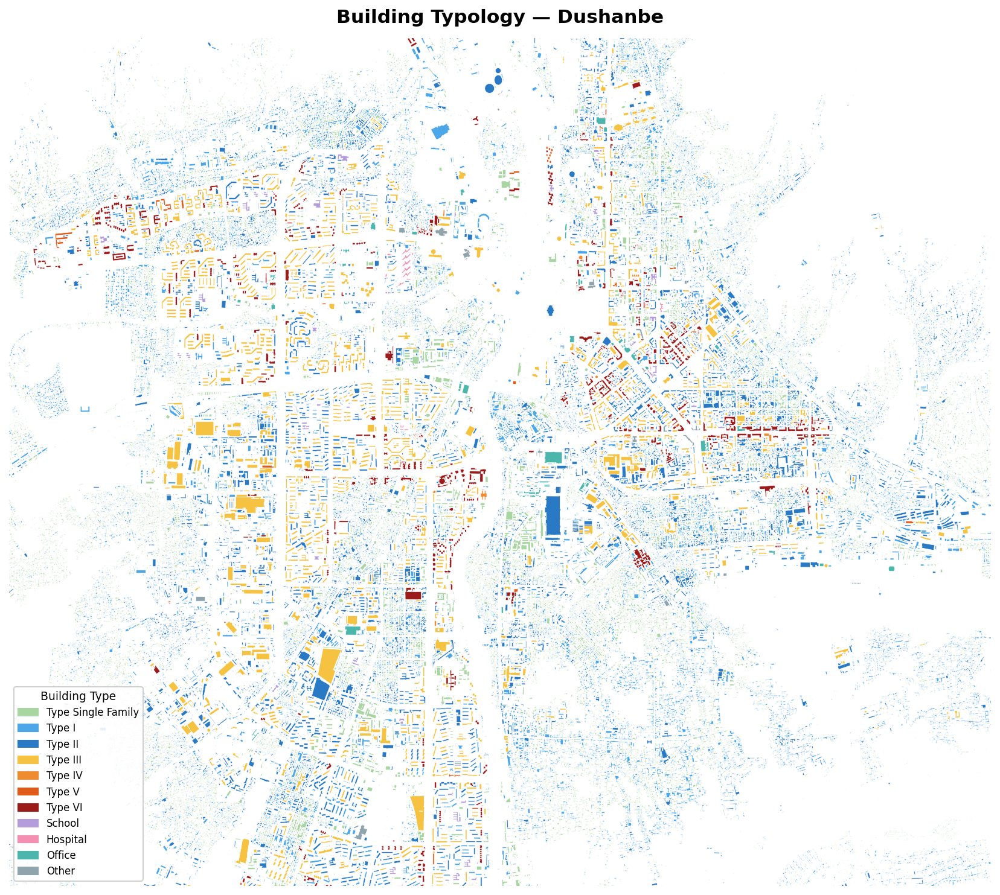
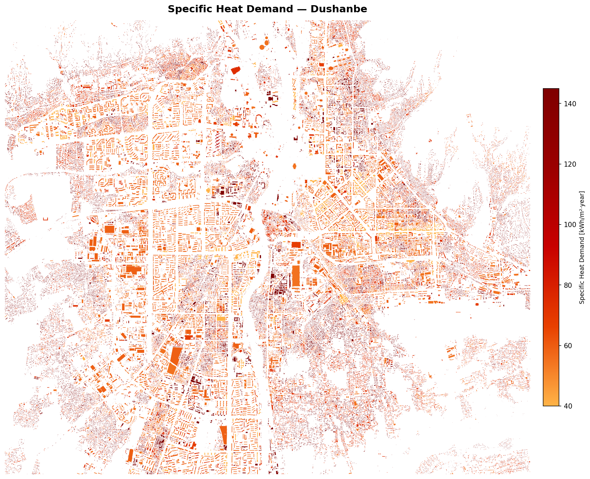
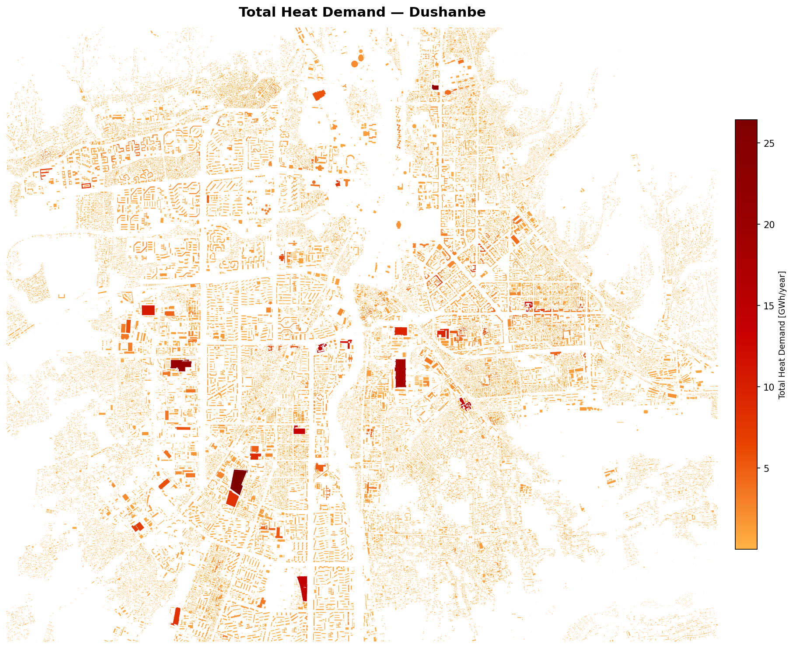

# GSHP DHC Tajikistan — Building Heat Demand Analysis (Dushanbe)

Spatial analysis of building stock heat demand in Dushanbe, Tajikistan,
based on building footprint data from a GeoPackage file.

## Scripts

### `preprocess_dushanbe.py`
Loads the raw building footprint GeoPackage (`Data/Dushanbe.gpkg`) and
enriches each building with the following fields:

| Field | Description |
|---|---|
| `floors` | Number of floors estimated from building height (height / 2.5) |
| `Tagging` | OSM `building=*` tag value (from spatial join with Geofabrik data) |
| `Use` | `residential` or `tertiary`, derived from `Tagging` |
| `Type` | Building typology (see tables below) |
| `Specific Heat Demand [kWh/m2·year]` | Specific heat demand assigned by typology |
| `Heated Area [m2]` | Total heated floor area (footprint area × floors) |
| `Total Heat Demand [GWh/year]` | Annual heat demand per building |

#### OSM Tagging → classification pipeline

1. **Spatial join with Geofabrik** (`Data/Geofabrik_tajikistan.gpkg`, layer
   `gis_osm_buildings_a_free`): for each building, the centroid is matched
   against OSM polygons with an explicit `building` tag. Where a match is
   found, the OSM tag is stored in `Tagging`.

2. **Default fallback** (where no OSM tag is available):
   - Residential buildings (original `Use` field): `house` (≤ 2 floors) or
     `apartments` (> 2 floors).
   - Tertiary buildings: `yes`.

3. **`Use` from `Tagging`**: tags in the residential group → `Use=residential`;
   all others → `Use=tertiary`.

4. **`Type` assignment**:
   - **Residential**: floor count determines the type (Type Single Family–VI).
   - **Tertiary**: `Tagging` determines the type directly; floor count is used
     only to compute heated area and heat demand.

#### OSM tag → Use mapping

| `building=` tag | Use |
|---|---|
| `house`, `detached`, `semidetached_house`, `bungalow`, `terrace` | residential |
| `apartments`, `residential`, `dormitory`, `block` | residential |
| everything else | tertiary |

#### OSM tag → Type mapping (tertiary)

| `building=` tag | Type |
|---|---|
| `school`, `kindergarten`, `college`, `university` | School |
| `hospital`, `clinic`, `doctors` | Hospital |
| `office`, `commercial`, `retail`, `industrial` | Office |
| `yes`, `public`, `civic`, `government`, `mosque`, `church`, `warehouse` | Other |

Output: `Results/Dushanbe_processed.gpkg`

---

### `maps_dushanbe.py`
Loads the processed GeoPackage and produces:

**Console summary** — building count, average floors, average heated area,
specific and total heat demand per typology.

**Static maps (PNG, 150 dpi):**
- `Types.png` — building typology with categorical colours
- `Specific_Heat_Demand.png` — specific heat demand (YlOrRd gradient)
- `Total_Heat_Demand.png` — total heat demand in GWh/year (YlOrRd gradient)

**Interactive maps (HTML, Folium/Leaflet):**
- `Types_interactive.html`
- `Specific_Heat_Demand_interactive.html`
- `Total_Heat_Demand_interactive.html`

All maps are centred on the geometric centroid of the dataset with a
configurable zoom level (`MAP_ZOOM = 1.5` by default).

## Results

### Building typologies


### Specific heat demand


### Total heat demand


## Data

| File | Description |
|---|---|
| `Data/Dushanbe.gpkg` | Building footprints with `height`, `Area`, `Volume`, `Surface`, `Use` |
| `Data/Geofabrik_tajikistan.gpkg` | OSM extract for Tajikistan ([Geofabrik](https://download.geofabrik.de/asia/tajikistan.html)); layer `gis_osm_buildings_a_free` used for tagging |

## Requirements

```
geopandas
matplotlib
numpy
folium
branca
```

Install in a virtual environment:

```bash
python3 -m venv .venv
.venv/bin/pip install geopandas matplotlib numpy folium branca
```

## Usage

```bash
.venv/bin/python3 preprocess_dushanbe.py   # spatial join + classification → Dushanbe_processed.gpkg
.venv/bin/python3 maps_dushanbe.py         # summary + static and interactive maps
```

## Building typology

### Residential (`Use = "residential"`)

| Type | Floors | Specific Heat Demand [kWh/m²·year] |
|---|---|---|
| Type Single Family | ≤ 2 | 145 |
| Type I | 3 | 74 |
| Type II | 4 | 55 |
| Type III | 5–8 | 59 |
| Type IV | 9 | 65 |
| Type V | 10–11 | 54 |
| Type VI | ≥ 12 | 40 |

### Tertiary (`Use = "tertiary"`)

| Type | Floors | Specific Heat Demand [kWh/m²·year] |
|---|---|---|
| School | ≤ 2 | 60 |
| Hospital | 3–4 | 102.5 |
| Office | 5 | 67.5 |
| Other | ≥ 6 | 67.5 |
